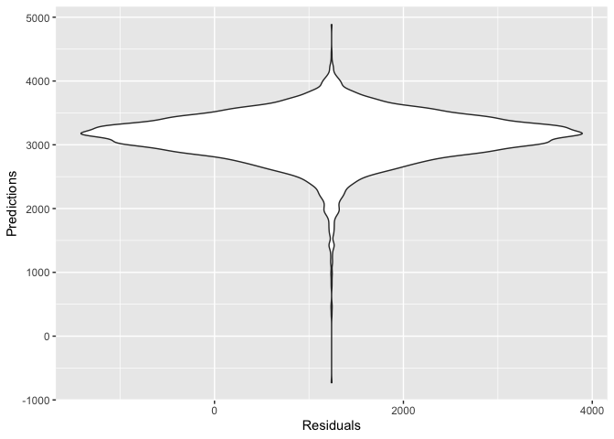
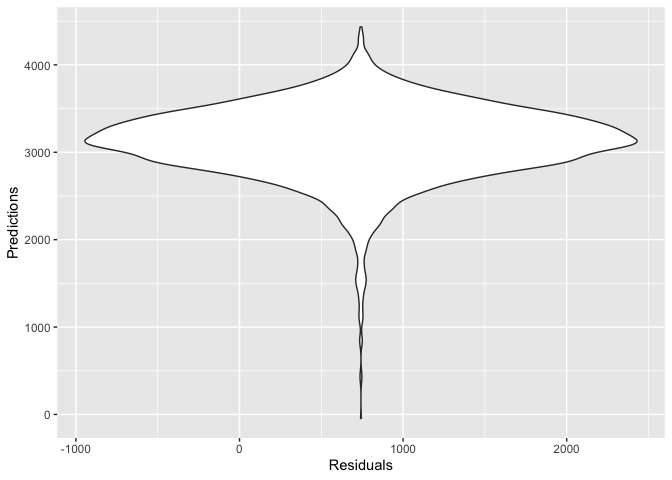
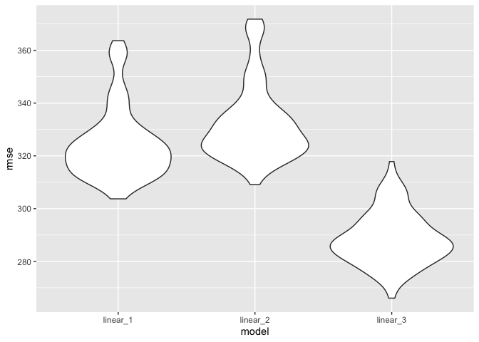
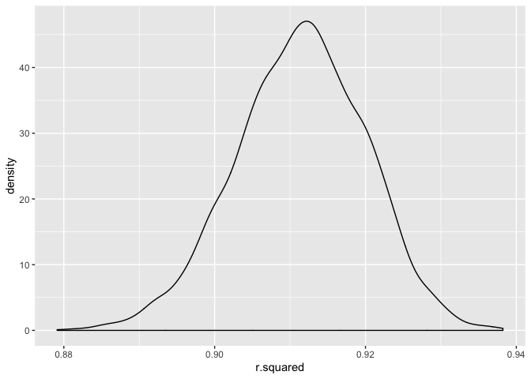
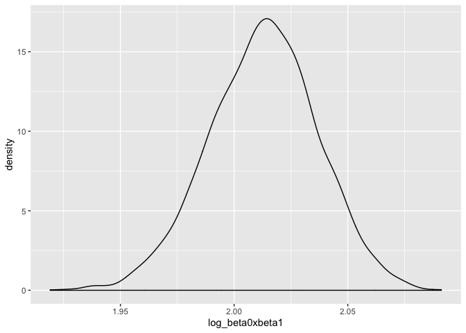

p8105\_hw6\_cx2227
================
Chuyue Xiang
11/21/2019

## Problem 1

``` r
birthweight = read_csv("./data/birthweight.csv")

str(birthweight)
```

    ## Classes 'spec_tbl_df', 'tbl_df', 'tbl' and 'data.frame': 4342 obs. of  20 variables:
    ##  $ babysex : num  2 1 2 1 2 1 2 2 1 1 ...
    ##  $ bhead   : num  34 34 36 34 34 33 33 33 36 33 ...
    ##  $ blength : num  51 48 50 52 52 52 46 49 52 50 ...
    ##  $ bwt     : num  3629 3062 3345 3062 3374 ...
    ##  $ delwt   : num  177 156 148 157 156 129 126 140 146 169 ...
    ##  $ fincome : num  35 65 85 55 5 55 96 5 85 75 ...
    ##  $ frace   : num  1 2 1 1 1 1 2 1 1 2 ...
    ##  $ gaweeks : num  39.9 25.9 39.9 40 41.6 ...
    ##  $ malform : num  0 0 0 0 0 0 0 0 0 0 ...
    ##  $ menarche: num  13 14 12 14 13 12 14 12 11 12 ...
    ##  $ mheight : num  63 65 64 64 66 66 72 62 61 64 ...
    ##  $ momage  : num  36 25 29 18 20 23 29 19 13 19 ...
    ##  $ mrace   : num  1 2 1 1 1 1 2 1 1 2 ...
    ##  $ parity  : num  3 0 0 0 0 0 0 0 0 0 ...
    ##  $ pnumlbw : num  0 0 0 0 0 0 0 0 0 0 ...
    ##  $ pnumsga : num  0 0 0 0 0 0 0 0 0 0 ...
    ##  $ ppbmi   : num  26.3 21.3 23.6 21.8 21 ...
    ##  $ ppwt    : num  148 128 137 127 130 115 105 119 105 145 ...
    ##  $ smoken  : num  0 0 1 10 1 0 0 0 0 4 ...
    ##  $ wtgain  : num  29 28 11 30 26 14 21 21 41 24 ...
    ##  - attr(*, "spec")=
    ##   .. cols(
    ##   ..   babysex = col_double(),
    ##   ..   bhead = col_double(),
    ##   ..   blength = col_double(),
    ##   ..   bwt = col_double(),
    ##   ..   delwt = col_double(),
    ##   ..   fincome = col_double(),
    ##   ..   frace = col_double(),
    ##   ..   gaweeks = col_double(),
    ##   ..   malform = col_double(),
    ##   ..   menarche = col_double(),
    ##   ..   mheight = col_double(),
    ##   ..   momage = col_double(),
    ##   ..   mrace = col_double(),
    ##   ..   parity = col_double(),
    ##   ..   pnumlbw = col_double(),
    ##   ..   pnumsga = col_double(),
    ##   ..   ppbmi = col_double(),
    ##   ..   ppwt = col_double(),
    ##   ..   smoken = col_double(),
    ##   ..   wtgain = col_double()
    ##   .. )

``` r
birthweight = birthweight %>% 
mutate(
  babysex = factor(babysex),
    frace = factor(frace),
    mrace = factor(mrace),
    malform = factor(malform)
  )

options(scipen=999)
fit = lm(bwt ~ blength + delwt + gaweeks + malform + menarche + momage + pnumlbw + ppbmi + ppwt + wtgain,
         data = birthweight)
fit %>% broom::tidy()
```

    ## # A tibble: 9 x 5
    ##   term        estimate std.error statistic   p.value
    ##   <chr>          <dbl>     <dbl>     <dbl>     <dbl>
    ## 1 (Intercept) -4314.     111.      -38.9   1.13e-283
    ## 2 blength       122.       1.99     61.1   0.       
    ## 3 delwt           5.09     0.468    10.9   3.31e- 27
    ## 4 gaweeks        24.3      1.69     14.4   6.72e- 46
    ## 5 malform1       32.4     84.1       0.386 7.00e-  1
    ## 6 menarche       -5.74     3.43     -1.67  9.45e-  2
    ## 7 momage          8.89     1.32      6.73  1.96e- 11
    ## 8 ppbmi         -11.2      3.02     -3.69  2.25e-  4
    ## 9 ppwt           -1.65     0.675    -2.44  1.47e-  2

``` r
birthweight %>% 
  add_predictions(fit) %>% 
  add_residuals(fit) %>%
  ggplot(aes(x = resid, y = pred)) + geom_violin() +
  labs(
    x = "Residuals",
    y = "Predictions"
  )
```

<!-- -->

``` r
#This model is built by selecting some factors I thought would be attrbutng to the weight of the baby, for example: the length of the baby, mother’s pre-pregnancy BMI, mother’s age at menarche, etc...

#However, through the chart, there is no clear interaction, so this model proposed is not effective.

fit2 = lm(bwt ~ blength + gaweeks, data = birthweight) 
fit2 %>% broom::tidy()
```

    ## # A tibble: 3 x 5
    ##   term        estimate std.error statistic  p.value
    ##   <chr>          <dbl>     <dbl>     <dbl>    <dbl>
    ## 1 (Intercept)  -4348.      98.0      -44.4 0.      
    ## 2 blength        129.       1.99      64.6 0.      
    ## 3 gaweeks         27.0      1.72      15.7 2.36e-54

``` r
birthweight %>% 
  modelr::add_residuals(fit2) %>% 
  modelr::add_predictions(fit2) %>% 
  ggplot(aes(x = resid, y = pred)) + 
  geom_violin()+
  labs(
    x = "Residuals",
    y = "Predictions"
  )
```

<!-- -->

``` r
fit3 = lm(bwt ~ bhead + blength + babysex + bhead*babysex + bhead*blength + blength*babysex + bhead*blength*babysex, data = birthweight)
fit3 %>% broom::tidy()
```

    ## # A tibble: 8 x 5
    ##   term                    estimate std.error statistic      p.value
    ##   <chr>                      <dbl>     <dbl>     <dbl>        <dbl>
    ## 1 (Intercept)            -7177.     1265.       -5.67  0.0000000149
    ## 2 bhead                    182.       38.1       4.78  0.00000184  
    ## 3 blength                  102.       26.2       3.90  0.0000992   
    ## 4 babysex2                6375.     1678.        3.80  0.000147    
    ## 5 bhead:babysex2          -198.       51.1      -3.88  0.000105    
    ## 6 bhead:blength             -0.554     0.780    -0.710 0.478       
    ## 7 blength:babysex2        -124.       35.1      -3.52  0.000429    
    ## 8 bhead:blength:babysex2     3.88      1.06      3.67  0.000245

``` r
birthweight %>% 
  modelr::add_residuals(fit3) %>% 
  modelr::add_predictions(fit3) %>% 
  ggplot(aes(x = resid, y = pred)) + 
  geom_violin()+
  labs(
    x = "Residuals",
    y = "Predictions"
  )
```

<!-- -->

``` r
# compare three models

cv_birthweight = crossv_mc(birthweight, 100)
  

cv_birthweight = cv_birthweight %>% 
  mutate(
    train = map(train, as_tibble),
    test =  map(test, as_tibble))
cv_birthweight = 
  cv_birthweight %>% 
  mutate(linearmodel1  = map(train, ~lm(bwt ~ blength + delwt + gaweeks + malform + menarche + momage + pnumlbw + ppbmi + ppwt + wtgain, data = .x)),
         linearmodel2  = map(train, ~lm(bwt ~ blength + gaweeks, data = .x)),
         linearmodel3  = map(train, ~lm(bwt ~ bhead + blength + babysex + bhead*babysex + bhead*blength + blength*babysex + bhead*blength*babysex, data = .x))) %>% 

  mutate(rmse_linear_1 = map2_dbl(linearmodel1, test, ~rmse(model = .x, data = .y)),
         rmse_linear_2 = map2_dbl(linearmodel2, test, ~rmse(model = .x, data = .y)),
         rmse_linear_3 = map2_dbl(linearmodel3, test, ~rmse(model = .x, data = .y)))

cv_birthweight %>% 
  select(starts_with("rmse")) %>% 
  pivot_longer(
    everything(),
    names_to = "model", 
    values_to = "rmse",
    names_prefix = "rmse_") %>% 
  mutate(model = fct_inorder(model)) %>% 
  ggplot(aes(x = model, y = rmse)) + geom_violin()
```

<!-- -->

  - from the voilin chart, the third model has the smallestt rmse which
    will has the best prediction on the baby’s weight.

## Problem 2

``` r
#data import

weather_df = 
  rnoaa::meteo_pull_monitors(
    c("USW00094728"),
    var = c("PRCP", "TMIN", "TMAX"), 
    date_min = "2017-01-01",
    date_max = "2017-12-31") %>%
  mutate(
    name = recode(id, USW00094728 = "CentralPark_NY"),
    tmin = tmin / 10,
    tmax = tmax / 10) %>%
  select(name, id, everything())
```

    ## Registered S3 method overwritten by 'crul':
    ##   method                 from
    ##   as.character.form_file httr

    ## Registered S3 method overwritten by 'hoardr':
    ##   method           from
    ##   print.cache_info httr

    ## file path:          /Users/向楚玥/Library/Caches/rnoaa/ghcnd/USW00094728.dly

    ## file last updated:  2019-09-26 10:25:19

    ## file min/max dates: 1869-01-01 / 2019-09-30

``` r
weather_df %>% 
  modelr::bootstrap(n = 5000) %>% 
  mutate(
    models = map(strap, ~lm(tmax ~ tmin, data = .x)),
    results = map(models, broom::glance)) %>% 
  select(-strap, -models) %>% 
  unnest(results) %>% 
  select(.id,r.squared) %>% 
  ggplot(aes(x = r.squared)) + geom_density()
```

<!-- -->

``` r
weather_df %>% 
  modelr::bootstrap(n = 5000) %>% 
  mutate(
    models = map(strap, ~lm(tmax ~ tmin, data = .x)),
    results = map(models, broom::tidy)) %>% 
  select(-strap, -models) %>% 
  unnest(results) %>% 
  select(.id,term,estimate) %>% 
  pivot_wider(names_from = term, values_from = estimate) %>% 
  mutate(
    log_beta0xbeta1 = log(`(Intercept)`*tmin, base = exp(1))) %>% 
  ggplot(aes(x = log_beta0xbeta1)) + geom_density()
```

<!-- -->

``` r
r_squared = 
weather_df %>% 
  modelr::bootstrap(n = 5000) %>% 
  mutate(
    models = map(strap, ~lm(tmax ~ tmin, data = .x)),
    results = map(models, broom::glance)) %>% 
  select(-strap, -models) %>% 
  unnest(results) %>% 
  select(.id,r.squared)
  

log = 
  weather_df %>% 
  modelr::bootstrap(n = 5000) %>% 
  mutate(
    models = map(strap, ~lm(tmax ~ tmin, data = .x)),
    results = map(models, broom::tidy)) %>% 
  select(-strap, -models) %>% 
  unnest(results) %>% 
  select(.id,term,estimate) %>% 
  pivot_wider(names_from = term, values_from = estimate) %>% 
  mutate(
    log_beta0_beta1 = log(`(Intercept)`*tmin, base = exp(1)))

# 95% Interval for r squared
quantile(r_squared$r.squared, probs= c(0.025,0.975))
```

    ##      2.5%     97.5% 
    ## 0.8941480 0.9270325

``` r
# 95% Interval for log(b0*b1)
quantile(log$log_beta0_beta1, probs= c(0.025,0.975))
```

    ##     2.5%    97.5% 
    ## 1.964836 2.058396
