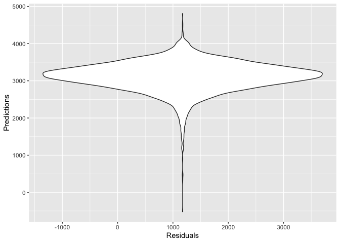

p8105\_hw6\_cx2227
================
Chuyue Xiang
11/21/2019

## Problem 1

``` r
birthweight = read_csv("./data/birthweight.csv")
```

    ## Parsed with column specification:
    ## cols(
    ##   .default = col_double()
    ## )

    ## See spec(...) for full column specifications.

``` r
str(birthweight)
```

    ## Classes 'spec_tbl_df', 'tbl_df', 'tbl' and 'data.frame': 4342 obs. of  20 variables:
    ##  $ babysex : num  2 1 2 1 2 1 2 2 1 1 ...
    ##  $ bhead   : num  34 34 36 34 34 33 33 33 36 33 ...
    ##  $ blength : num  51 48 50 52 52 52 46 49 52 50 ...
    ##  $ bwt     : num  3629 3062 3345 3062 3374 ...
    ##  $ delwt   : num  177 156 148 157 156 129 126 140 146 169 ...
    ##  $ fincome : num  35 65 85 55 5 55 96 5 85 75 ...
    ##  $ frace   : num  1 2 1 1 1 1 2 1 1 2 ...
    ##  $ gaweeks : num  39.9 25.9 39.9 40 41.6 ...
    ##  $ malform : num  0 0 0 0 0 0 0 0 0 0 ...
    ##  $ menarche: num  13 14 12 14 13 12 14 12 11 12 ...
    ##  $ mheight : num  63 65 64 64 66 66 72 62 61 64 ...
    ##  $ momage  : num  36 25 29 18 20 23 29 19 13 19 ...
    ##  $ mrace   : num  1 2 1 1 1 1 2 1 1 2 ...
    ##  $ parity  : num  3 0 0 0 0 0 0 0 0 0 ...
    ##  $ pnumlbw : num  0 0 0 0 0 0 0 0 0 0 ...
    ##  $ pnumsga : num  0 0 0 0 0 0 0 0 0 0 ...
    ##  $ ppbmi   : num  26.3 21.3 23.6 21.8 21 ...
    ##  $ ppwt    : num  148 128 137 127 130 115 105 119 105 145 ...
    ##  $ smoken  : num  0 0 1 10 1 0 0 0 0 4 ...
    ##  $ wtgain  : num  29 28 11 30 26 14 21 21 41 24 ...
    ##  - attr(*, "spec")=
    ##   .. cols(
    ##   ..   babysex = col_double(),
    ##   ..   bhead = col_double(),
    ##   ..   blength = col_double(),
    ##   ..   bwt = col_double(),
    ##   ..   delwt = col_double(),
    ##   ..   fincome = col_double(),
    ##   ..   frace = col_double(),
    ##   ..   gaweeks = col_double(),
    ##   ..   malform = col_double(),
    ##   ..   menarche = col_double(),
    ##   ..   mheight = col_double(),
    ##   ..   momage = col_double(),
    ##   ..   mrace = col_double(),
    ##   ..   parity = col_double(),
    ##   ..   pnumlbw = col_double(),
    ##   ..   pnumsga = col_double(),
    ##   ..   ppbmi = col_double(),
    ##   ..   ppwt = col_double(),
    ##   ..   smoken = col_double(),
    ##   ..   wtgain = col_double()
    ##   .. )

``` r
birthweight = birthweight %>% 
mutate(
  babysex = factor(babysex),
    frace = factor(frace),
    mrace = factor(mrace),
    malform = factor(malform)
  )

options(scipen=999)
fit = lm(bwt ~ blength + delwt + gaweeks + malform + menarche + momage + pnumlbw + ppbmi + ppwt + wtgain,
         data = birthweight)
fit %>% broom::tidy()
```

    ## # A tibble: 9 x 5
    ##   term        estimate std.error statistic   p.value
    ##   <chr>          <dbl>     <dbl>     <dbl>     <dbl>
    ## 1 (Intercept) -4314.     111.      -38.9   1.13e-283
    ## 2 blength       122.       1.99     61.1   0.       
    ## 3 delwt           5.09     0.468    10.9   3.31e- 27
    ## 4 gaweeks        24.3      1.69     14.4   6.72e- 46
    ## 5 malform1       32.4     84.1       0.386 7.00e-  1
    ## 6 menarche       -5.74     3.43     -1.67  9.45e-  2
    ## 7 momage          8.89     1.32      6.73  1.96e- 11
    ## 8 ppbmi         -11.2      3.02     -3.69  2.25e-  4
    ## 9 ppwt           -1.65     0.675    -2.44  1.47e-  2

``` r
birthweight %>% 
  add_predictions(fit) %>% 
  add_residuals(fit) %>%
  ggplot(aes(x = resid, y = pred)) + geom_violin() +
  labs(
    x = "Residuals",
    y = "Predictions"
  )
```

    ## Warning in predict.lm(model, data): prediction from a rank-deficient fit
    ## may be misleading
    
    ## Warning in predict.lm(model, data): prediction from a rank-deficient fit
    ## may be misleading

<!-- -->

  - This model is built by selecting some factors I thought would be
    attrbutng to the weight of the baby, for example: the length of the
    baby, mother’s pre-pregnancy BMI, mother’s age at menarche, etc…

  - However, through the chart, there is no clear interaction, so this
    model proposed is not effective.
